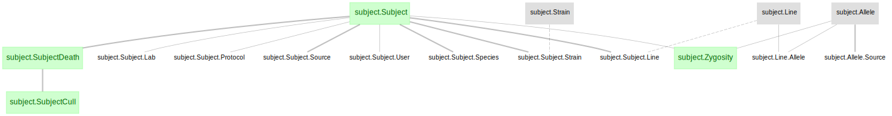

# DataJoint Element - Animal

+ `element-animal` features a DataJoint pipeline design for subject and genotyping management. 

+ `element-animal` is not a complete workflow by itself, but rather a modular design of tables and dependencies. 

+ `element-animal` can be flexibly attached to any DataJoint workflow.

+ See the [Element Animal documentation](https://elements.datajoint.org/description/animal/) for the background information and development timeline.

+ For more information on the DataJoint Elements project, please visit https://elements.datajoint.org.  This work is supported by the National Institutes of Health.

## Element architecture

There are two modules in `element-animal`:
+ subject: contains the basic information of subject, including Strain, Line, Subject, Zygosity, and SubjectDeath information
+ genotyping: this module is designed for labs that keep track of colony management and genotyping results, containing information of breeding, weaning, housing, and genotyping.

### Subject Diagram


### Genotyping Diagram


## Installation
```
pip install element-animal
```

If you already have an older version of ***element-animal*** installed using `pip`, upgrade with
```
pip install --upgrade element-animal
```

## Element usage

+ `element-animal` is not a complete workflow by itself, but rather a modular design of tables and dependencies that can be flexibly attached to any DataJoint workflow.

+ See the [workflow-session](https://github.com/datajoint/workflow-session) repository for example usage of `element-animal`.

+ Also refer to the [workflow-calcium-imaging](https://github.com/datajoint/workflow-calcium-imaging) and [workflow-array-ephys](https://github.com/datajoint/workflow-array-ephys) repositories for example usages of `element-animal` when combining with other elements.

## Citation

+ If your work uses DataJoint and DataJoint Elements, please cite the respective Research Resource Identifiers (RRIDs) and manuscripts.

+ DataJoint for Python or MATLAB
    + Yatsenko D, Reimer J, Ecker AS, Walker EY, Sinz F, Berens P, Hoenselaar A, Cotton RJ, Siapas AS, Tolias AS. DataJoint: managing big scientific data using MATLAB or Python. bioRxiv. 2015 Jan 1:031658. doi: https://doi.org/10.1101/031658

    + DataJoint ([RRID:SCR_014543](https://scicrunch.org/resolver/SCR_014543)) - DataJoint for `<Select Python or MATLAB>` (version `<Enter version number>`)

+ DataJoint Elements
    + Yatsenko D, Nguyen T, Shen S, Gunalan K, Turner CA, Guzman R, Sasaki M, Sitonic D, Reimer J, Walker EY, Tolias AS. DataJoint Elements: Data Workflows for Neurophysiology. bioRxiv. 2021 Jan 1. doi: https://doi.org/10.1101/2021.03.30.437358

    + DataJoint Elements ([RRID:SCR_021894](https://scicrunch.org/resolver/SCR_021894)) - Element Animal (version `<Enter version number>`)